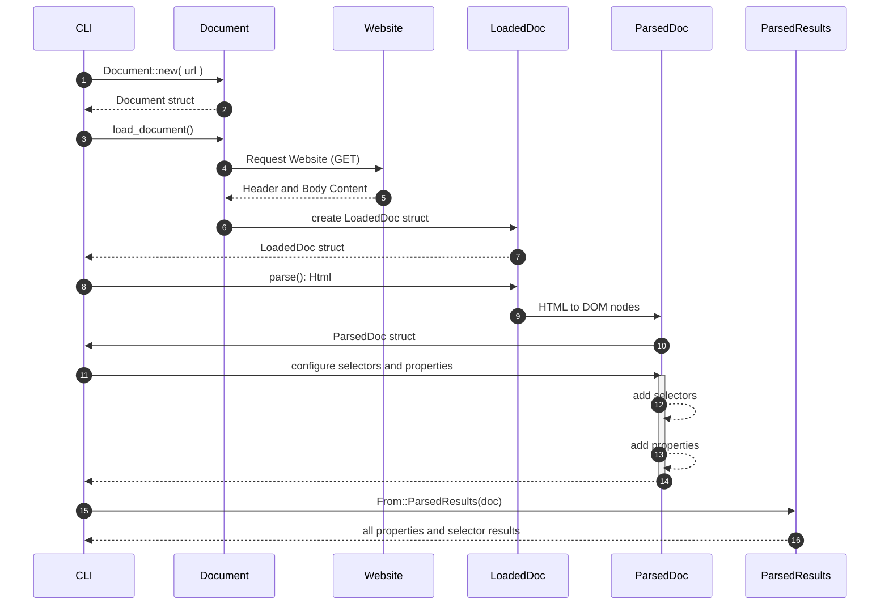

# Scraped

A Rust web scraper which provides a high-level configuration interface to scrape meta data from URL based resources.

This is a monorepo which consists of the following packages:

- `lib` - the rust "scraped" crate / library
- `cli` - the CLI is packaged in **npm** module system as "scraped" a NAPI-RS API providing native performance to the Windows, Linux, and macOS targets
- `wasm` - secondarily we package a CLI that compiles the core library down to a WASM target and wraps this with a thin Javascript wrapper so that it can easily work on any platform

## Backstory

This package was originally developed to help facilitate building search indexes for the Rust API documents of the [Tauri](https://tauri.studio) project and still supports that task but it has grown to provide a more generalized interface that can be used for lots of scraping needs.

> this library sits on the shoulder of the `scrape` crate which provides all the lower level DOM selector querying capabilities.


## Basic Flow of a Page Scrape



- **Create a `Document`**
    ```rust
    let doc: Document = Document::new("https://google.com");
    ```
    - Steps 1 & 2 show future intent to scrape a particular site. 
    - This simply lazily captures URL and it's only responsibility is ensuring that the String representation of the URL is indeed a valid URL
- **Load the Document**

    ```rust
    let doc: LoadedDocument = doc.load_document().await?;
    ```

    - The URL passed in is used to capture the Headers and Body content from the network response (which uses the popular **reqwest** crate)
    - This _state_ is typically quite temporal in nature as the received content is stored "as is" from the network request and provides no means to "query" the document yet. For this reason, the `Document` structure also provides a `parse()` function which in essence skips the `LoadedDocument` step:

        ```rust
        let doc: ParsedDoc = doc.parse().await?;
        ```

- **The Parsed Document**
  
    - When a `LoadedDocument` nees to be converted to `ParsedDoc` this can be done synchronously now that the network request is out of the way:

      ```rust
      // where "doc" is a LoadedDocument
      let doc: ParsedDoc = doc.parse();
      ```

    - We are now at the first "interesting phase" of this crate's existance. This is where you will _configure_ the results you're hoping to be able to scrape from the document.
